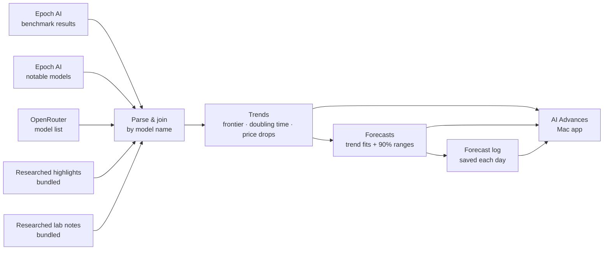

# AI Advances

**A Mac app that tracks where AI is heading.** It follows the latest model releases, what each model and lab is working on, and the long-run trends in capability, cost, context and compute, and turns those trends into dated forecasts that update themselves from public data.

| Direction Trends | Labs |
|---|---|
|  |  |

| Capabilities | Models | Cost |
|---|---|---|
|  |  |  |

| Latest Advances | Context & Modalities | Compute |
|---|---|---|
|  |  |  |

## How it works

The app checks for fresh data on launch and every 6 hours while it's open. It needs no API keys, and a snapshot is bundled so it works offline.

**[Setup and usage guide →](docs/GUIDE.md)**

Data: [Epoch AI](https://epoch.ai/benchmarks) (CC BY 4.0) and [OpenRouter](https://openrouter.ai/models).
