# AI Advances

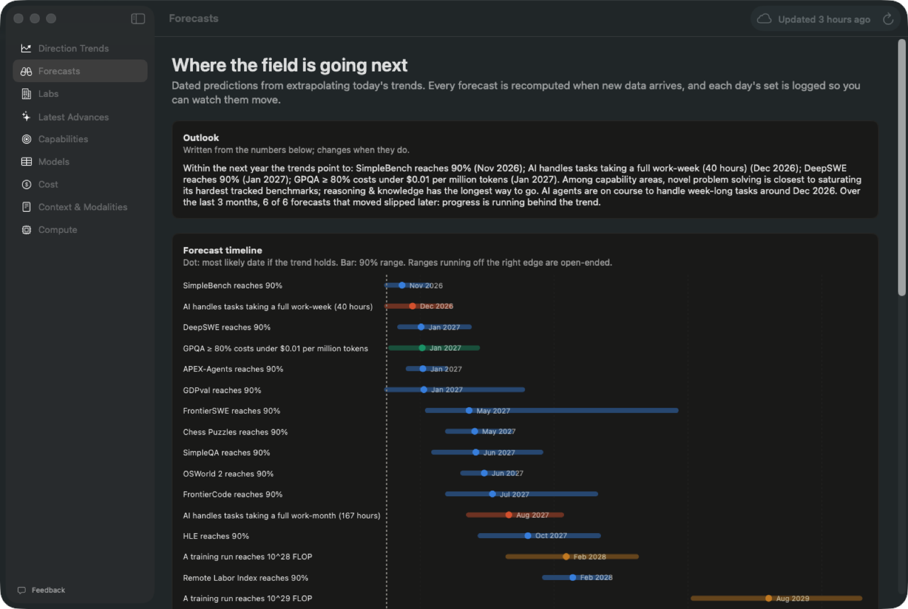

**A Mac app and website that track where AI is heading.** They follow the latest model releases, what each model and lab is working on, and the long-run trends in capability, cost, context and compute, and turn those trends into dated forecasts that update themselves from public data.

**Website:** [amalmehta.github.io/ai-advances](https://amalmehta.github.io/ai-advances/), rebuilt daily. **Mac app:** [download the latest release](https://github.com/amalmehta/ai-advances/releases/latest) (Apple Silicon and Intel, macOS 14+).

| Website | |
|---|---|
| 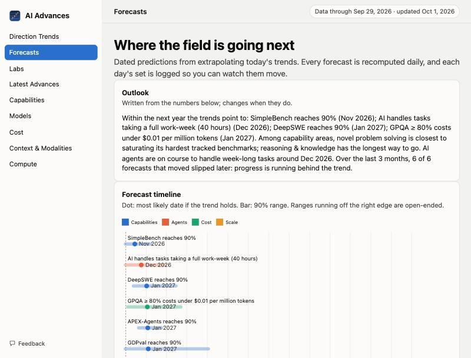 | Same nine pages as the Mac app, in the browser, on phones too. A GitHub Action rebuilds it every day with the same Swift analysis code. |

| Direction Trends | Labs |
|---|---|
| 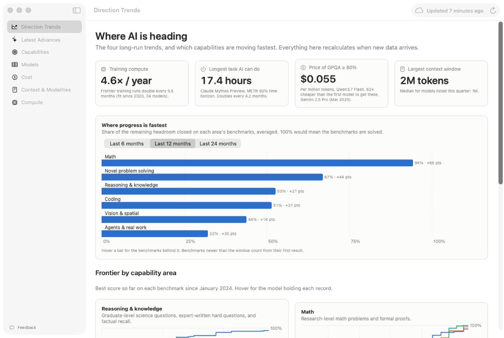 | 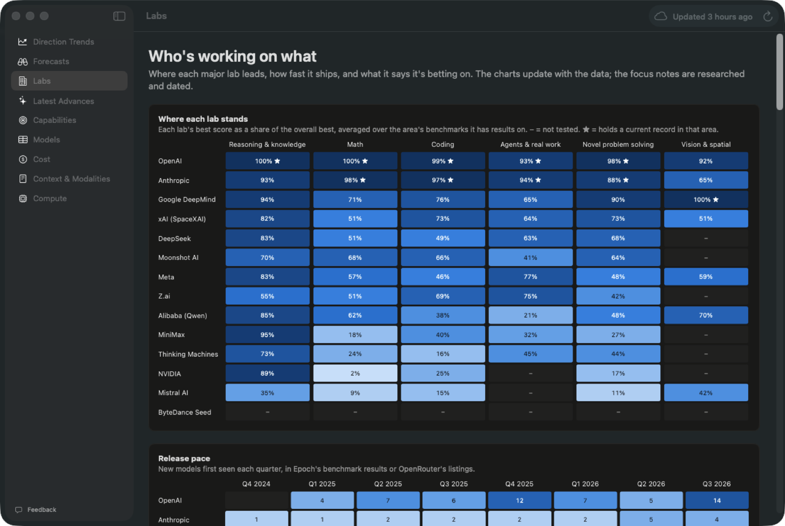 |

| Capabilities | Models | Cost |
|---|---|---|
| 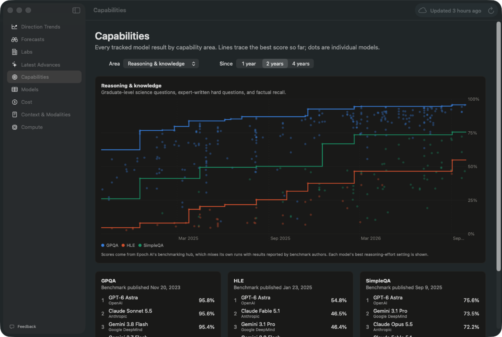 | 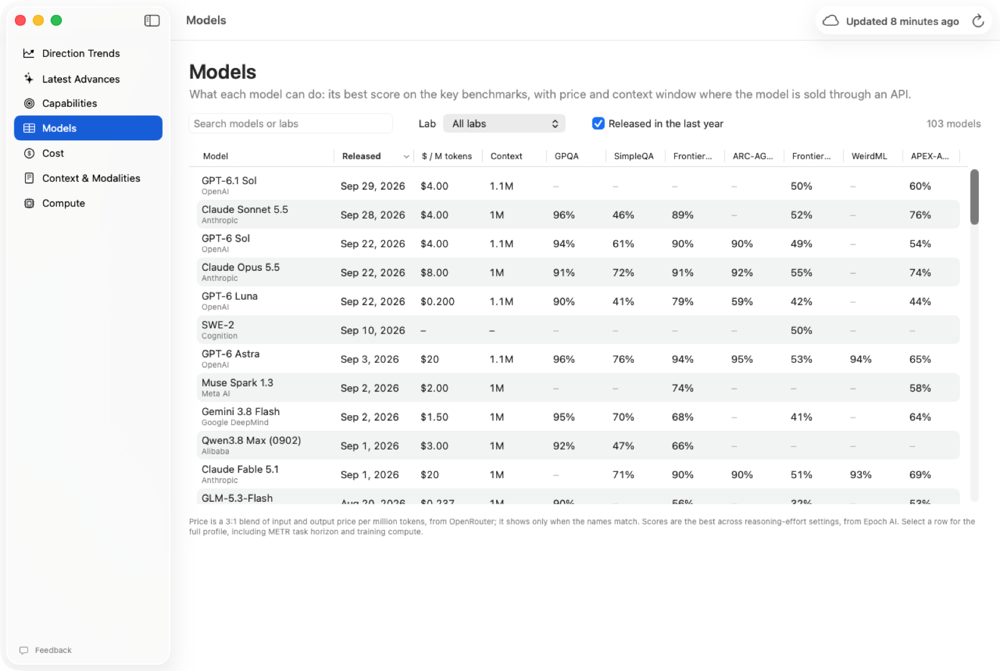 | 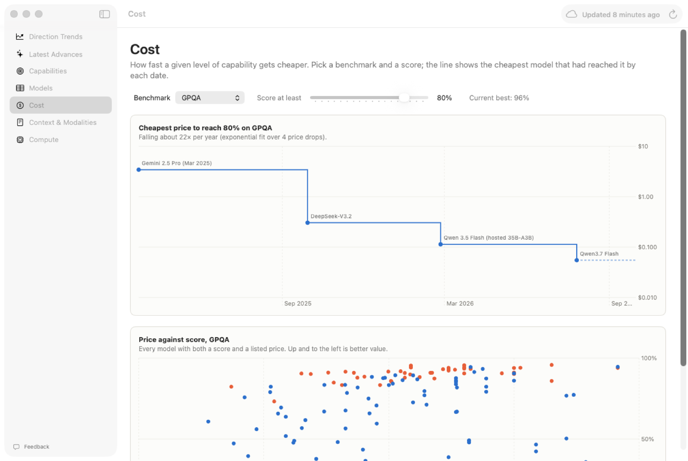 |

| Latest Advances | Context & Modalities | Compute |
|---|---|---|
| 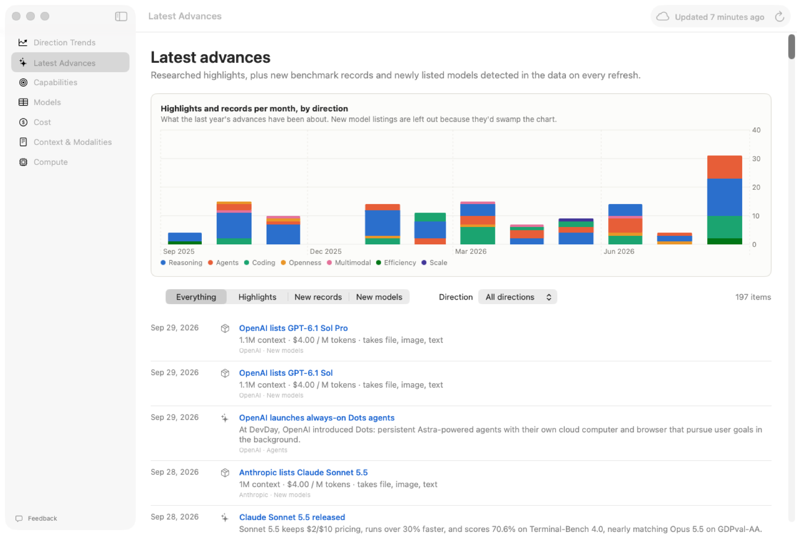 | 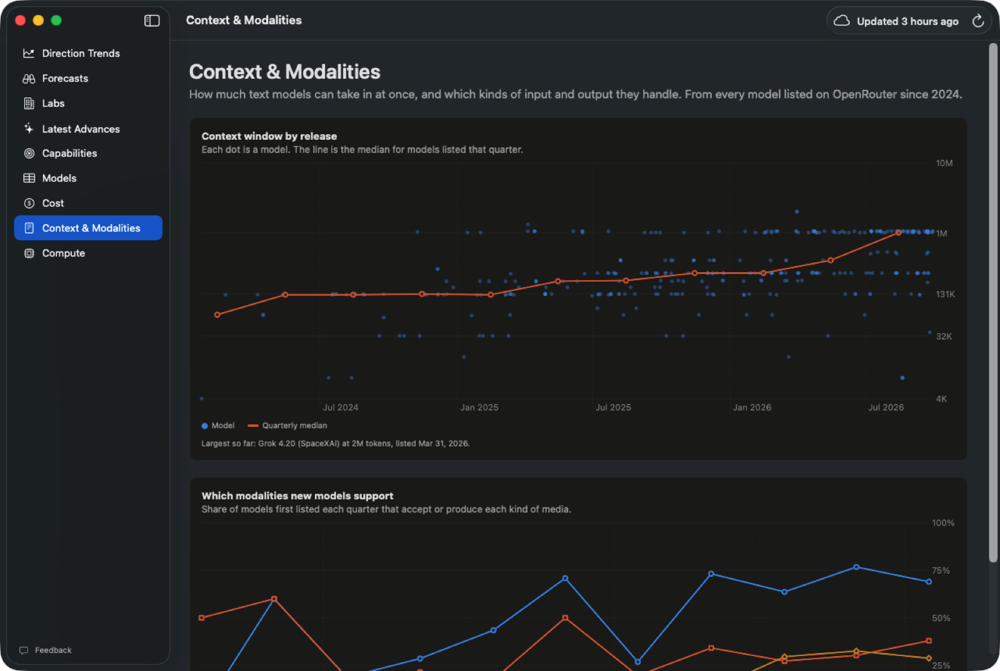 | 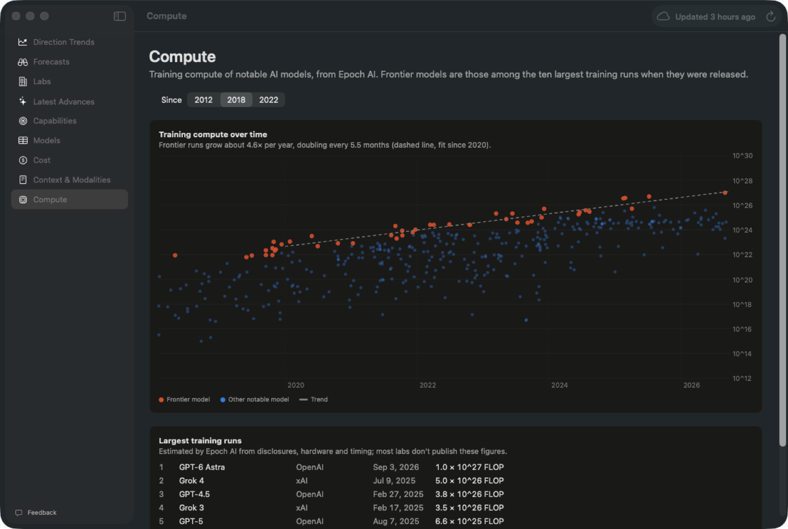 |

## How it works

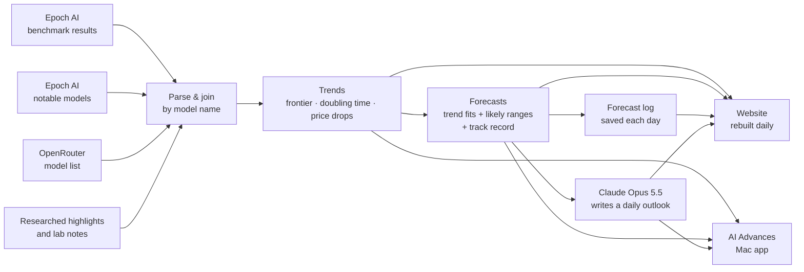

Both update every morning: the website is rebuilt before dawn Pacific time (ready by 7 AM), and the app refreshes at launch or 7 AM local. The data needs no API keys. The optional Claude-written outlook uses an Anthropic API key stored as the `NEW_SECRET` repository secret.

**[Setup and usage guide →](docs/GUIDE.md)**

Data: [Epoch AI](https://epoch.ai/benchmarks) (CC BY 4.0) and [OpenRouter](https://openrouter.ai/models).
